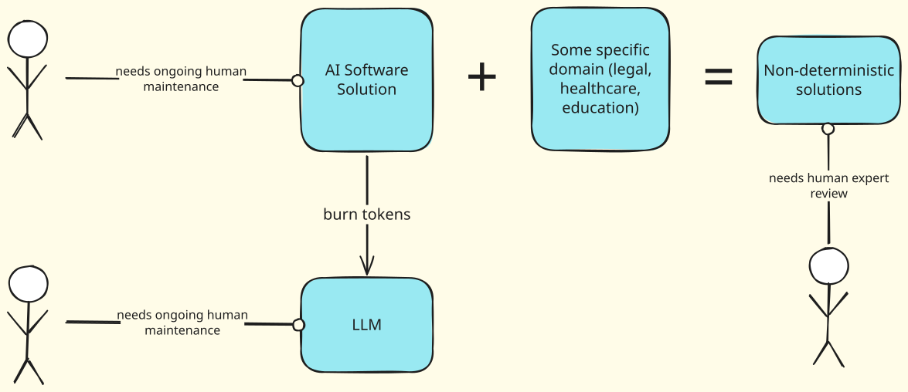

# Automation vs AI

Like many fields, software development has not yet been 'solved'. Humans still need to be heavily involved in designing and shipping a production-grade piece of software, especially at an enterprise level.

## Everyone is Confused and Everyone Wants AI

Many businesses out there think they need AI. They don't really know what that means, but they know they need it. Companies want to see this magic new invention help them boost productivity while keeping costs low. Yeah, we all wanna have & eat cake.

I came across an interesting post titled [Stop Building AI Agents](https://www.reddit.com/r/AI_Agents/comments/1taei9m/stop_building_ai_agents/) on `/r/AI_Agents`, with a helpful warning given towards the end:

>If you're a founder about to spend money on an agent, answer these on paper first:
>
>- Can I draw the workflow as clear steps? If yes, you want an automation.
>
>- Does the workflow have more than 5 branches with truly unpredictable inputs? Then maybe an agent.
>
>- Is the cost of the worst-case wrong answer high? If yes, you want an automation, not an agent.
>
>- Will compliance ever look at this? If yes, automation. Full stop.

## Automation Opportunity

I think a lot of people, even those who are "good at computers" don't realize what manual steps they're taking in their work life that could be easily automated. Automation, when designed properly, is reliable and consistent.

Because AI tools can speed up the software development process by magnitudes, creating custom automation solutions would be pretty quick and easy, compared to before AI (BAI?). 

I liked the approach that Mustafa Suleyman, co-founder of DeepMind, did early on in the company. Here's an excerpt from *The Infinity Machine: A Quest for Superintelligence*:

>A FEW WEEKS into his investigations, Suleyman met a doctor named Chris Laing at the Royal Free Hospital in North London. Laing suggested that DeepMind’s first health project should be AKI—acute kidney injury. Shockingly, one in seven British hospital patients experienced kidney malfunction. Each year, for lack of timely treatment, around forty thousand died. Thousands of others needed a kidney transplant or lifelong dialysis, costing the NHS around £1 billion annually.
>
>Suleyman made a proposal. DeepMind would build an AI system to predict the onset of kidney failure. But Laing explained that prediction was **not the immediate problem**. The NHS already conducted blood tests that identified kidney trouble; the challenge was to get the test results to clinicians. Hospitals still relied on old-fashioned pagers to notify doctors. But the doctors had to find a moment to call the number on the pager, and by the time they did so, whoever had beeped them was often no longer available. Alternatively, hospitals depended on doctors and nurses to log on to clunky computers and scan hundreds of blood readings. Hours could go by between a test that flashed a need for urgent care and somebody noticing the emergency.
>
>Plenty of AI executives would have backed off at this point. Getting blood-test results to doctors was a simple software challenge; it had nothing to do with artificial intelligence. But Suleyman cared about the problem first. If the solution did not initially involve AI, so be it. He would help to fix the software now, then deliver AI later.
>
>[...]
>
>Suleyman assembled a team of engineers and designers and dispatched them to the hospital. He told them to shadow the clinicians as they went on their rounds: to watch them fill their notebooks with hand scribbles; to see how they struggled with the ancient “cows”—the computers on wheels, which were buggy and unstable.
>
>“I wanted them to smell the hospital smells and hear the constant beeps and understand what it’s like to be in a depressed sensory state,” Suleyman told me.
>
>“You have to know all of those things to create beautiful software that really works in that environment.”
>
>Within a few weeks, the first version of Suleyman’s AKI alert system, called Streams, was being tested in the hospital. The blood lab zapped notifications directly to smartphones; patients who might have died got timely attention. For Chris Laing and his NHS colleagues, the speed of this transformation was a miracle—“an almost hallucinatory experience,” Laing called it. “It’s very difficult to articulate just how much of a step up this was,” he marveled; “that willingness to just get started.” Laing was an NHS veteran, and he had never seen a pilot project get off the ground this fast before. “It was definitely the highlight of my career,” he told me.

All of this happened in 2016, before the conveniences of generated code existed. Streams would likely have been implemented a lot quicker if it were built today.

## What About Money Tho

Whenever there's hype and hysteria, there's opportunity to make money. Right now people **GOTTA HAVE AI**. Everyone had to have a website and many others had to have blockchain. The outcomes of these scenarios differ, but the human behavior around them was/is the same.

Are AI solutions saving money for companies overall? I don't know. In my head, things look a little like this:

If one were to attempt to AI-ify a multi-step, complex process, it will need still need human help along the way. Bigger companies could gain an edge against smaller competitors [now have that some of them have money to make an in-house LLM](https://www.harvey.ai/blog/post-training-update-harvey-tenet). Harvey in particular:

>In March, the company raised $200 million at a valuation of $11 billion, in a round led by Sequoia Capital and GIC. The company, which has annual recurring revenue of about $350 million, is now looking to raise $500 million at a valuation of $15.5 billion, according to a person familiar with the matter.

- from [WSJ](https://www.wsj.com/cio-journal/harvey-remakes-its-ai-legal-platform-by-adding-memory-cf3f6563). After 'adding memory' to their product, which is hardly revolutionary.

I suppose you could build a prototype, raise money and hype, knowing that your product will get outclassed by competitors. If you raise enough money maybe could walk away satisfied.

**Update 9/6**: yknow what I disagree with the above now - Harvey.AI could be garbage. I don't know what legal benchmarks are all about. It's probably hella expensive. Seeing this competitor [HAQQ](https://www.haqq.ai/pricing) is interesting. Sounds like a good strategy - having an application for the legal human workflows and then a separate subscription for AI chat that can fluidly interact with the application. I wonder what kinds of mistakes and challenges these companies have made so far.
