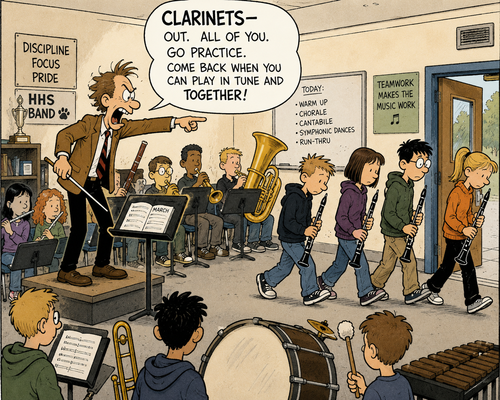
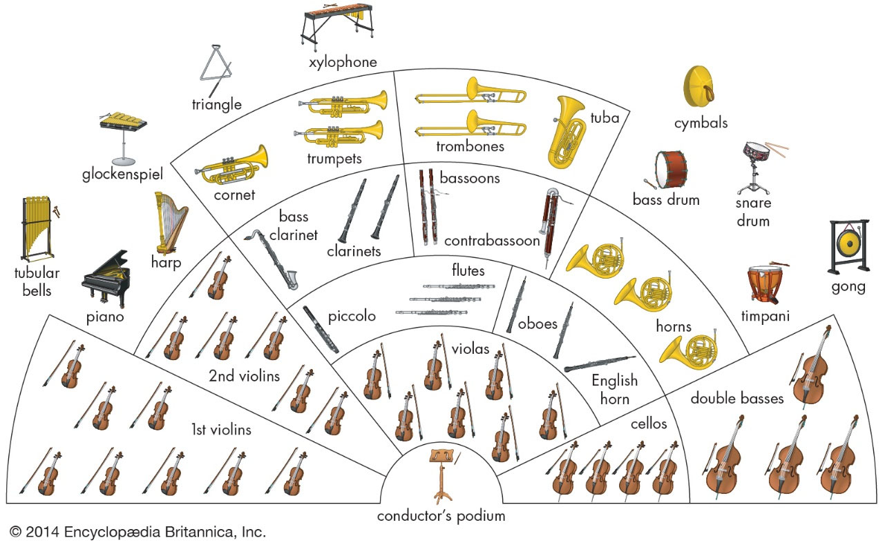
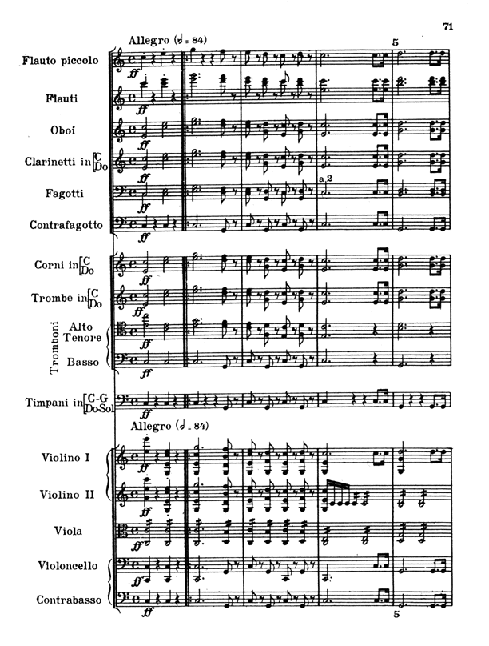

## Background

My music director & conductor was an intimidating man, known for being very particular, impatient and moody.

Mr. H was always drilling the necessity of daily practice into our heads. If a group of clarinets were sounding sloppy during rehearsals, he might stop rehearsal and force each member to play their parts 1-by-1, admonishing the weaker players and generously praising the ones who could get it right. 

>"See? Deedee could play it right. Why didn't you practice like Deedee did?"
 
And if the whole group of said clarinets was fumbling, Mr. H would simply send them outside of the room to practice elsewhere. If you couldn't play your notes right, then you weren't welcome to play in rehearsal! 

Rehearsal was for bringing shape and cohesion to the music, it was **not** the time to figure out your notes and rhythms. He said he wanted to treat us as adult music professionals and he held us to this standard. Except the part where he would put the kids in rehearsal timeouts.

  

In all seriousness, Mr. H was one of those people with strong natural leadership energy; it's one of those things that's hard to describe. Even those who didn't really care for his personality or methods still wanted to earn his respect, deep down.

But this writeup isn't really about Mr. H. He's retired now after all!

## What Is A Conductor?

  

A **conductor** isn't just someone standing in front of musicians waving their arms around, though some audience members may think so.

The conductor acts as a unifying leader among all the musicians in the orchestra. They set the pacing and emotional tones of a **performance** across all instrument groups; he has to keep track of **cross-functional** complexities at once. This requires a unique set of abilities: deep musical mastery, a high volume of **technical** musical knowledge, **rapid** auditory-motor skills and stage presence.

  

<i>A conductor should know the entire ensemble, while players often don't ever see each other's sheet music</i>

---

**Music directors** are conductors who have their own orchestra. They will conduct only during the most high-profile times for the orchestra; other times of the year the orchestra uses junior/guest conductors.

In addition to conducting, music directors spend time maintaining important relationships, curating what music will be played for the season, securing endowments and being the face of the orchestra.

There are more musicians than conductors and more conductors than music directors.

## The Concertmaster

In groups of instruments, there are 'chairs'. If you have 5 clarinet players, you have 5 chairs. First chair clarinet player is typically the best player, followed by second chair, etc.

1st chair violin is also known as the **concertmaster**. The concertmaster leads tuning before rehearsal, sets the bowing direction for all string players and is the only member to ceremoniously shake hands with the conductor during performances.

The concertmaster helps provide a technical layer of cohesion between the rest of the players and the music director (or guest conductor).

## The end

Wow what other metaphors could come from this? Coaches and players maybe? Amazing.