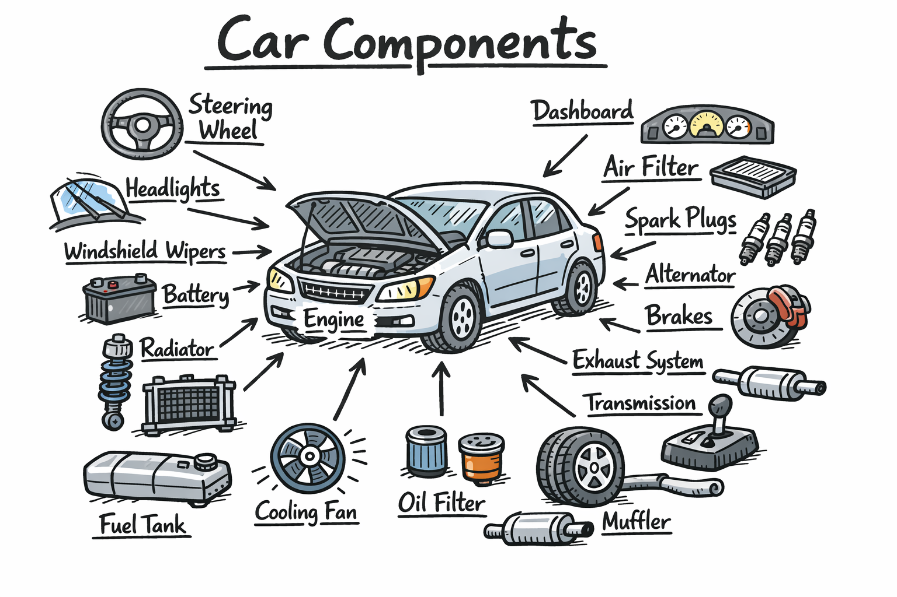
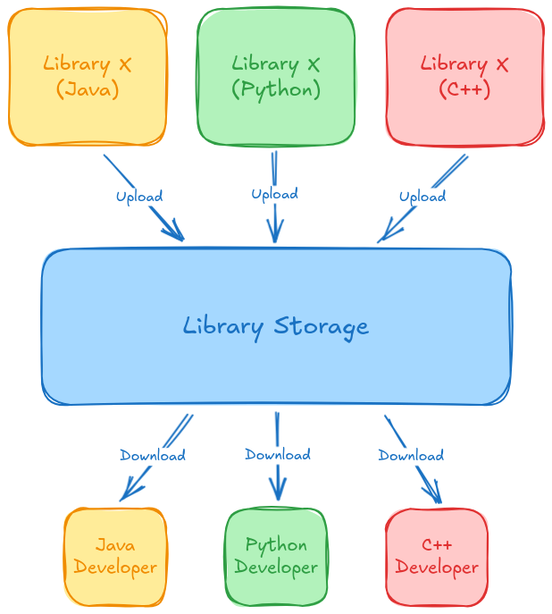
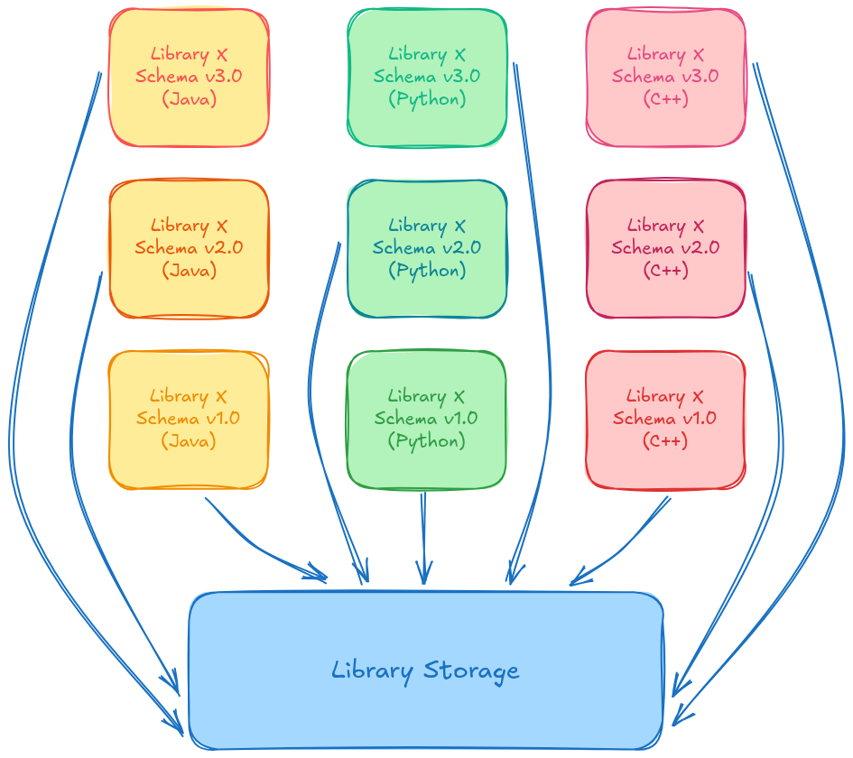
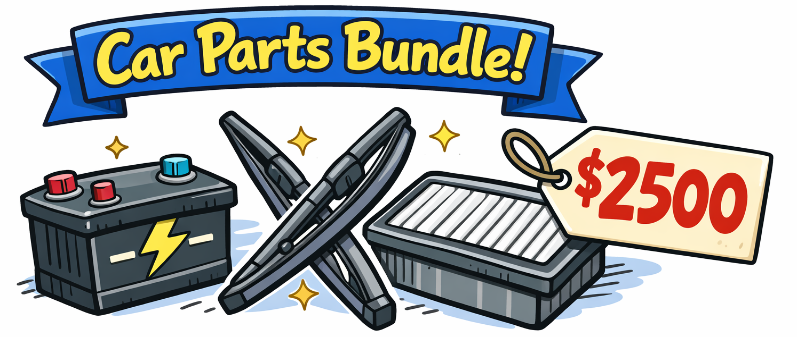
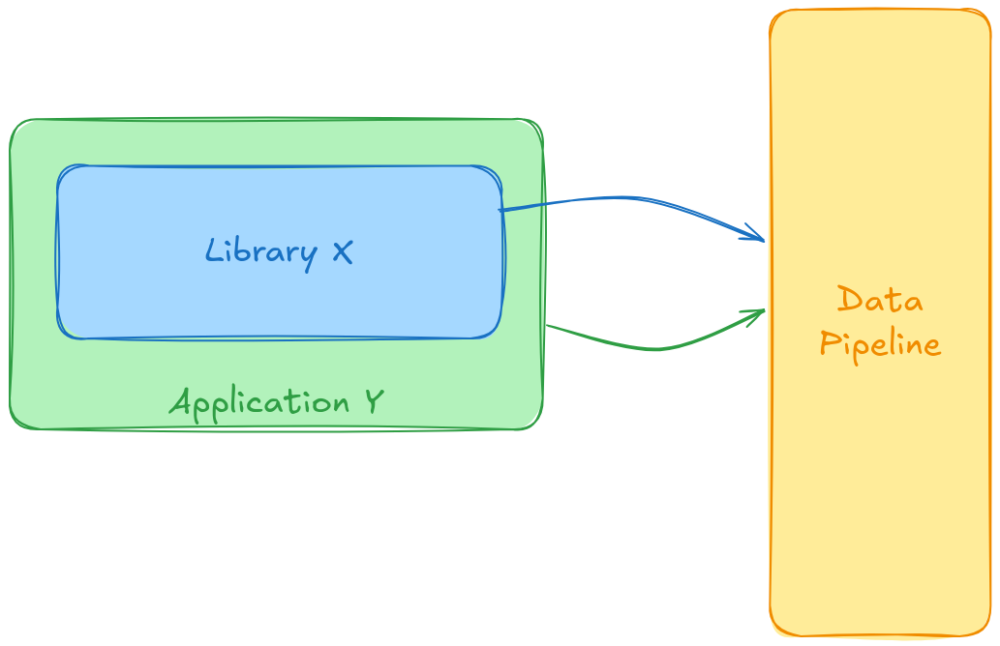
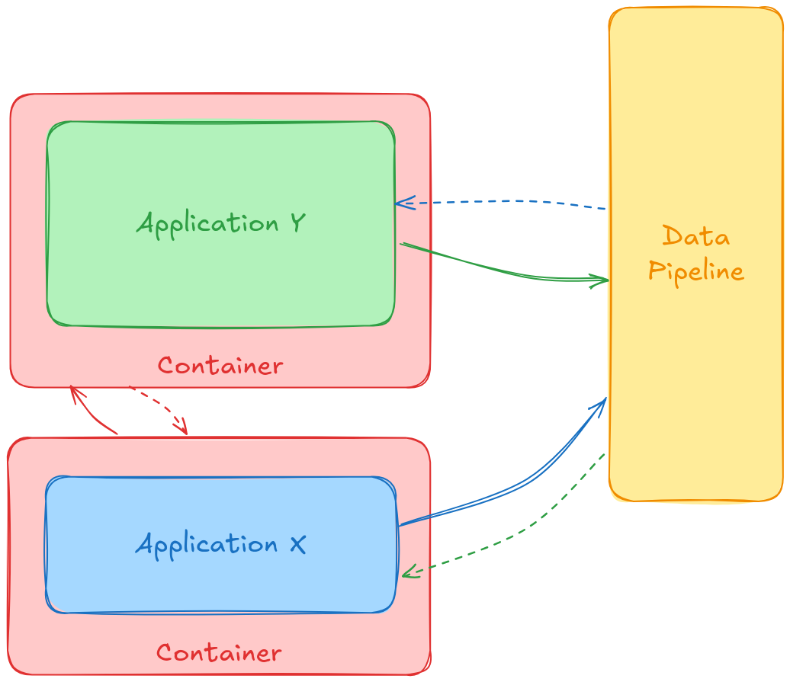

# Cost of Library Maintenance

## Motivation

When trying to explain a certain technical debt to non-technical leadership in order to help them understand the resources they were inheriting in a legacy project, there was confusion.

The idea of a 'library' itself can be an abstract concept to someone unfamiliar with software. 

Here, I attempt to illustrate what a library is and why, in the case of Library X, it is not worth the cost maintenance. 

In the original problem used for inspiration, there were alternatives offered and a bit more detail about why Library X wasn't providing value. That will not be illustrated here.

## What is a Library?

If an **application is a car**, then a **library is a car component**.

Imagine being in charge of building a car. Let's say you have some of the parts but not all of them. You don't want to manufacture the missing parts from scratch, understandably. 

Instead, you:

  - Acquire the **car components (libraries)** you need
  - Have **mechanics (software devs)** assemble it all together.

## Cost of Maintaining Library X

Library X is used within multiple applications among multiple developers.

**Uploads** and **Downloads** each have their own pain points that may require maintenance, even if the underlying code of Library X was untouched.

Additionally, when other developers use Library X, they may run into build issues in their application that may or may not be the 'fault' of Library X. This costs time and can cause frustration via finger-pointing between developer teams.

### Multiple Language and Schema Issues

Library X has been maintained under the assumption that it will offer the same capabilities across languages and across schemas. It has been offered in multiple programming languages and multiple schemas for each language.

However, this becomes overwhelming quickly:

### Value of Library X

Library X attempts to solve multiple problems at once. 
However the value this provides from a software perspective is like overpaying for a bundle of car components:

## Recommendations

Offer standalone solutions that will only utilize 1 programming language. These standalone solutions can be shared instead. This prevents:

  - Being involved or a source of culpability when other developers cannot build their code. 
  - Make it easier to maintain multiple schemas
  - Reduce the need to have developers proficient in multiple programming languages
  - Break down Library X features into more manageable pieces

In the car analogy, this is like **offering a car accessory for an already built car**.

### Before

### After

