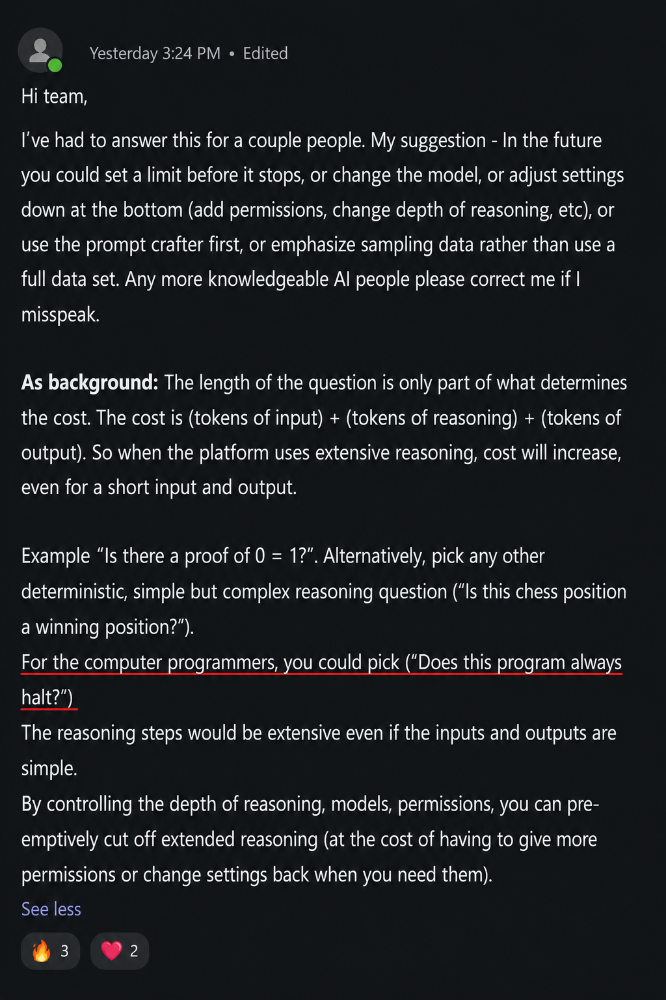

# Goodbye Open Tab Season Bloopers

This AI era is bringing lots of pain and exposing the ignorance of the common man. Sometimes you just have to step back and laugh.

These are the highlights of dumb shit and trends I've experienced in the past year, after corporate-led, company-wide adoption of AI.

- [Goodbye Open Tab Season Bloopers](#goodbye-open-tab-season-bloopers)
  - [Corporate Wisdom](#corporate-wisdom)
  - ["How Do I Not Run Out of Tokens?"](#how-do-i-not-run-out-of-tokens)
  - [Idiocracy in the Tech World](#idiocracy-in-the-tech-world)
  - [Honorable Mention](#honorable-mention)

## Corporate Wisdom

> **AI Leadership**: "You have to get to know each model, just like if you were dating them. Each one is a little different. I recommend Gemini."

- Alright, good to know which LLM you're roleplaying with at home. Please keep that shit to yourself. I know exactly what you're doing with all those 5090's at home that you brag about.

> **Leadership**: AI is success. We have 98% adoption.

- Woohoo!

> **Leadership to the software engineer team**: "Can we do the work of 3 software engineers with 1 software engineer? Can we support this hardware in 1 month? How much is it going to cost in tokens?"

- Kay yeah lemme get out my crystal ball. FYI, the tools we've been using during Open Tab Season haven't tracked the majority of SWE token usage. We literally have no data to even begin to answer this question.

## "How Do I Not Run Out of Tokens?"

	 
	<em>?????????????</em>

## Idiocracy in the Tech World

- **AI slop PRs:** Junior SWEs complaining about senior SWEs opening massive PRs of AI slop. This is actually a little sad, because the juniors really look forward to learning from the experienced folks.

- **Duct tape and prayers:** Stuff breaking more than usual due to overreliance on AI. For example, a software update on our VPN resulted in permanently breaking my work laptop. After multiple escalations, no one could figure out my problem. The resolution? Send me a new laptop. Seriously..?

- **Brain rot:** Why think when you can just ask AI? Unfortunately the brain adapts to habits — it's a "use it or lose it" situation. We are fuuuucked, yo.

## Honorable Mention

**Friend's idea:** proposed [generating comic slop like this](https://www.youtube.com/watch?v=QgffFMy2S80&t=2702s) to get YouTube views and generate some passive income. I mean, he's not wrong — it doesn't seem overly saturated. But holyyyy shit. Is this entertainment now?

---
---

Send help. Where are the aliens? Save us from ourselves!!
