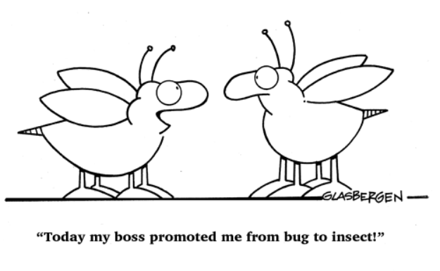

# Goodbye Open Tab Season

> Vague musings and reflections, **not advice**

Some companies may have started out giving employees an open tab for token usage, when adopting AI tools. 

- [Goodbye Open Tab Season](#goodbye-open-tab-season)
  - [A New Family Member](#a-new-family-member)
  - [Party's Over](#partys-over)
  - [Can't We Install Our Own AI?!](#cant-we-install-our-own-ai)
  - [Don't Hate The Player..Play The Game?](#dont-hate-the-playerplay-the-game)

## A New Family Member

Perhaps some companies are interested in maintaining their own VS Forks instead of third party solutions like Cursor or Devin. This is an interesting approach, though maybe not the best one. Sometimes installers and setup for such things don't work well and documentation is non-existent. It costs money to maintain internal software, and the quality of such software is debateable.

   
  <em>Yes. This is the way.</em>

Some new job families have popped up in the current AI age, like AI/ML Engineers, where the pay bands are 1 level above standard SWEs (SWE II == AI/ML III), likely accounting for current market demand. The shiny new titles also have 10 - 30% travel requirements as part of public job posting descriptions. Apparently this is to stay up to date on tech and for client related travel; maybe Company A wants to buy and adopt Company B's VS Code fork, though I'm not sure why that would be the case. But this is all conjecture, who knows what's going on these days? Blind leading the blind? Sound strategies for adopting AI in large companies seem to be rare because no one really knows what's going on.

   
  <em>Same person, different bucket!</em>

## Party's Over

Open tab season is coming to a close soon, so it will be interesting to see how employees adjust when tokens become limited. I had an interesting back and forth with an AI Director discussing how he envisions employees coping when open tab season ends. He was very reasonable and discussed how it's important to be conservative for selecting the right model for the right job. I believe that is too high of an ask for the average user, and model selection will have to be optimized by the agent instead of the user. He did point me to the fact that [Uber blew through it's AI budget](https://fortune.com/2026/05/26/uber-coo-ai-spending-tokens-claude-code/) when employees were given free reign. 

   
  <em>Glad it's not my money!</em>

## Can't We Install Our Own AI?!

I'm pleased to know that not every company is deciding to maintain their own LLMs. Apparently the better performing open-source LLMs tend to be Chinese. And regardless of origin, security is a concern for open-source LLMs. Still, internally forking off some open-source LLM could play a role in reducing cost of AI-enhanced work someday.

## Don't Hate The Player..Play The Game?

I'm wary of the hiring of any AI 'experts', since real AI experts are being employed in top companies with extremely high salaries. There are not enough AI experts to go around, but there are plenty of people willing to be paid and titled an AI expert.

I've noticed in many companies, in white collar work, mediocre or even low performance doesn't result in any consequences related to job security. There is evidence of low effort employees being able to coast for decades, even until retirement, though it may take a little longer for them to get promotions along the way. 

I wonder, is it better to save a good chunk of mental energy for outside work? Why give 100% for the sake of someone else's pockets? Maybe I save some of that mental energy to use towards my own ideas. Maybe if it's possible to generate money despite low quality and dysfunction, a new venture wouldn't be as daunting as previously thought. Most companies are riddled with problems but keep chugging along anyway.
