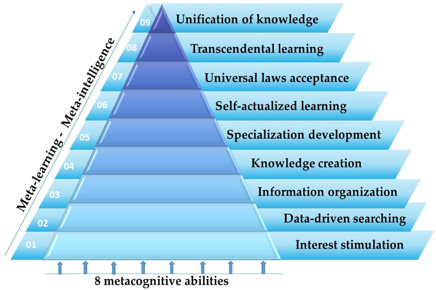
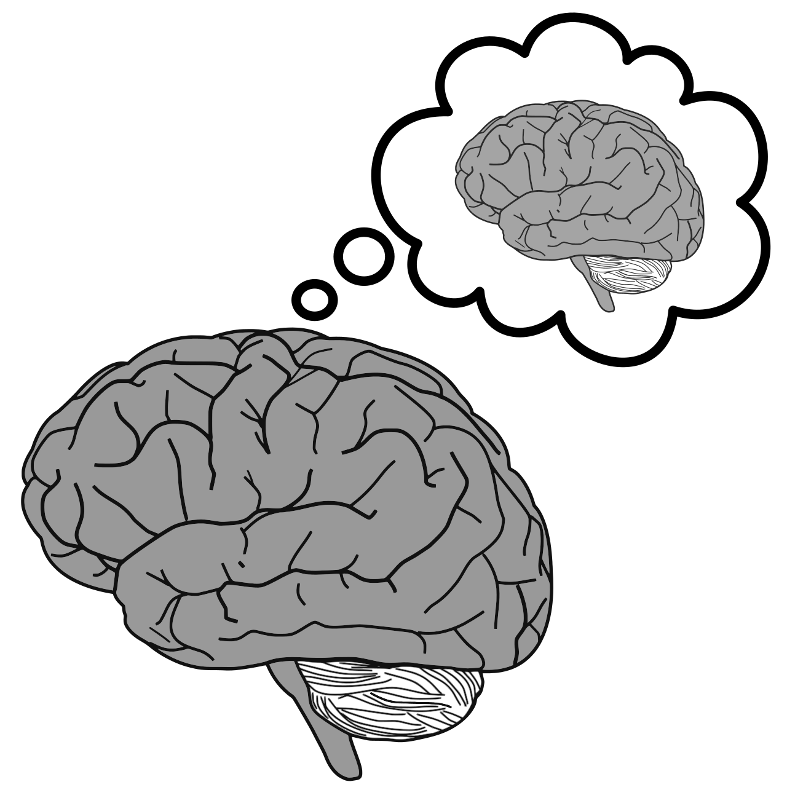
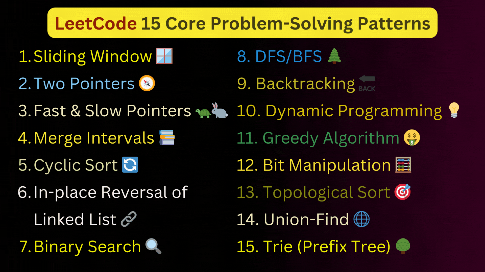

- [Metacognition Is Awesome](#metacognition-is-awesome)
  - [Disorganized Rant Incoming in 3...2..](#disorganized-rant-incoming-in-32)
  - [Metacognition: A Primer](#metacognition-a-primer)
  - [Learning and Emotions](#learning-and-emotions)
  - [Don't Memorize](#dont-memorize)
  - [Think For Yourself](#think-for-yourself)
  - [Go Read the Dang Paper](#go-read-the-dang-paper)

# Metacognition Is Awesome

## Disorganized Rant Incoming in 3..2..

In college, I took a mandatory writing course (against my will!) which ended up introducing me to 2 groundbreaking ideas: Metacognition (thinking about thinking) and learning transfer (using knowledge of 1 domain to assist in another domain. e.g. - bioinformatics combines computer science and biology). I ended up enjoying it so much that I took 2 more writing courses under the same professor and for a time I seriously considered taking up writing as a minor.

Throughout this rant I'll sometimes be sprinkling in quotes from this awesome paper, [Meta-Learning: A Nine-Layer Model Based on Metacognition and Smart Technologies](https://www.researchgate.net/figure/The-nine-layered-model-of-meta-learning-based-on-metacognition-represents-the-meta-levels_fig2_367157509) published in 2023 that was **already discussing the implications of AI** (‼️) and what that would mean for humans & learning going forward.

  

Let's dive in!

## Metacognition: A Primer

  

If you've ever had an epiphany, great idea or solution to a problem, have you ever wondered just how your brain got there? 

Or maybe something finally 'clicked' when you were learning a new skill. But how did that happen? Can you replicate it? Should you just practice more..? Read more..? What if time is limited?

I believe a lot of learning 'digestion' and solidification happens subconsciously. Your brain stitches together new connections and information even when you aren't actively reading/practicing/consciously thinking about the new information or skill you're trying to learn.

> "Recent neuroscientific research provides evidence that learning never stops, not even
when sleeping. On the contrary, it is a dynamic process of development and remodeling
of the brain architecture through the growth of new neurons and stronger connections."

- In other words, 'sleeping on it' is actually some great folk wisdom! 💤

> "Metacognition is defined as the set of regulatory meta-abilities and meta-skills that learners consciously apply to regulate cognitive and psychophysiological operations, resulting in optimal learning outcomes. Metacognition includes learners’ meta-ability to monitor, regulate and adapt their internal cognitive processes, identify the difference between functional and dysfunctional states of mind, and consciously select those states that awaken the full range of their learning potential. Metacognition shows the consciousness learners have about their abilities, skills, and strategies as well as the flexibility to strategically utilize their mental powers to achieve higher goals. Metacognition provides learners with the unique ability to have supervision over learning, to seek the reasons, to wonder about the meaning of knowledge, and search for self-understanding."

- Consciously, we can boost our own learning processes. It requires a certain level of mindful awareness that each of us are capable of forming.

## Learning and Emotions

Therapeutic techniques and tools like journaling are often encouraged when someone is working through emotional challenges. Writing is actually a great way to get in touch with one's own thought process (metacognition)!

  

- Journaling is a layered, beneficial thing to do; it's not just something for your grandmother or that one homeschooled kid.

By utilizing metacognition, we can really get in touch with ourselves to find answers to questions like:

- I'm feeling irritable right now but I don't know why. Can I find the answer so I can recognize (and possibly prevent) my irritability earlier on in the future?
- Why did I respond with 'xyz' when what I really felt was 'abc'?

Strong emotions can affect your physiology and thus, your ability to learn. A stressed person going to school or work is at a learning disadvantage compared to their non-stressed counterpart. 

> "Hormones and neurotransmitters released during and after stressful situations are recognized as important modulators of human learning and memory capacity. For instance, an extreme elevation of the stress hormones (i.e., cortisol) minimizes learners’ ability to take control of the learning procedures. In addition, abnormal alterations have been associated with learning difficulties. Human physiology plays an important role in learners’ mood stability and positivity, which in turn accelerates the speed of learning and motivates students to learn."

- This touches upon the importance to be humble and be kind to others. ❤️

## Don't Memorize

A problem exists that happens when memorization of certain datasets is the shortest (and sometimes the only practical) path to success.

I remember many of my biology/pre-med courses would have hundreds of powerpoint slides. The end goal of the course was to be prepared for any random bullet point or fact that might end up on the exam. Cue flashcards and cramming.

Even if you sort of actually understood a biological system, if you didn't happen to recall that one little factoid on slide 99 from 3 weeks ago, you'd find yourself in a situation where you would need to guess on a multiple-choice exam. Consistent high scorers, I'd later find out, were actually using old exams from previous years to study with, often inherited through Greek life groups (aka soft cults for young sheep 🐑).

- Kind of scary when you realize this is the system that is helping to develop our future doctors!

The same issue exists with software engineering job interviews and Leetcode; this is the process of using obscure algorithmic problems to measure a candidate's problem solving ability in hopes of hiring 'a good one'. The issue with Leetcode is that the only conclusion you can confidently draw from a high performing candidate is that they had free time and were willing to spend it on practicing Leetcode. The problem is, **anyone** can get better at solving small-scoped puzzles by practicing, given enough time and dedication - even IQ tests. It doesn't really test problem-solving skills at a deeper level.

- What is Leetcode actually screening for? Endurance? Willingness to embrace the grind? Measure of free time? 🤷

  

*Good job, you solved a problem that's already been solved a million times over by others! Now go join the herd.*

> "The crucial thing for learners is not to follow a path but to discover or develop a passion for learning that will constantly motivate them to bushwhack a path of their own, even through uncertain terrain."

If you're actually learning and are engaged, you will remember the important stuff. No forced memorization needed. If a system promotes memorization as a path to success, start asking questions.

## Think For Yourself

> "The history of science has shown that the most significant developments usually come after a conflict between new and existing theoretical insights and usually appear to defy common sense."

While it's important to be able to engage in constructive debate and maintain good relations with peers/colleagues, you don't want to fall into the trap of groupthink. 

  

Related to rote memorization, groupthink encourages a lack of critical thinking. 

If you become a meta-thinker, you should be able to find out *why* you find something to be true/right and *how* that came to be. Sometimes the knowledge we have, even the knowledge we feel most secure about, is actually hogwash that needs to be abandoned! 

- If you've ever said something and then felt off in your gut afterwards, dig into that. Are you parroting something that feels untrue, deep down? Challenge it!
- Never stop asking the why's or the how's. Don't get too comfortable in your own knowledge base.
- QUESTION EVERYTHING!!

## Go Read the Dang Paper

In many ways, we as humans are very early on in this whole learning schtick. You've gotta remember that throughout most of human history, **the vast majority of people were illiterate**. Knowledge was valuable and even if you wanted it, you couldn't necessarily have it.

These days, knowledge access is vast and cheap. Use it! Grab that delicious knowledge. Roll in it, flip it, reflect on it, disagree with it, then agree with it and then disagree with it again. Embrace that inner child of curiosity & imagination that is within all of us.

!! Also !! - totally recommend this short, free online course by Barbara Oakley, [Learning How to Learn](https://www.coursera.org/learn/learning-how-to-learn). It was helpful to me when I felt intimidated switching to an engineering track in college and initially struggled in my courses after coming from the memorization-hell of biology. The tl;dr on it is don't brute force learning and give your brain breaks to process. Rome wasn't built in a day.
