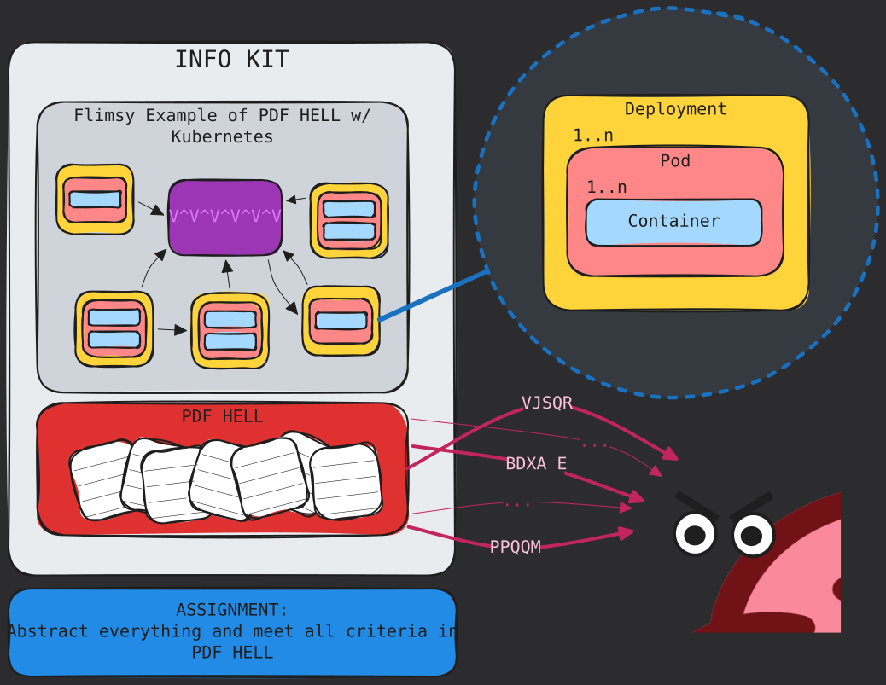

# The Telephone Problem

- [The Telephone Problem](#the-telephone-problem)
  - [Languages are Imperfect](#languages-are-imperfect)
  - [Communication Hard, Bro](#communication-hard-bro)
  - [Work Challenges](#work-challenges)
  - [Know The Minimums](#know-the-minimums)
  - [Use Metaphors! Find Common Ground!](#use-metaphors-find-common-ground)

There's a pervasive issue everywhere that involves communication.

If you've ever played the game 'telephone' and witnessed how passing information from 1 person to the next can degrade the information, well. Great. The world basically runs on 'telephone' happening in real time.

## Languages are Imperfect

For a historical example, just look at the Bible and how much debate there is over what really happened, and the evolution of interpretations of the Bible over time as it was translated from one language to the next. The thing is, no matter the debate, it's impossible to know the original intent of authors from so long ago.

In a corporation, this is seen many times over. How often is it that you have to repeat conveying information a second or third time? Or maybe your words are misconstrued and then you must spend time undoing the damage. Sometimes we paraphrase: `"John told me about the new plans for xyz"`. But maybe John originally said something like `"I hope there's a plan in place for xyz soon"`. And now a rumor starts circulating that 'xyz' is planned!

## Communication Hard, Bro

Why is it so hard for us to communicate? It's probably a combination of lack of attention, insufficient listening/reading comprehension and a fun little thing our brain does: filling in missing gaps of information with plausible details. Language structure, accents, dialects and speech styles that vary across demographics and backgrounds also play a role. In other words, it gets complicated quick!

The more abstract and technical information gets, the harder it is for everyone to get on the same page.

## Work Challenges

Now imagine trying to abstract a container framework such as Kubernetes/Docker Swarm and combine the dense technicality of government-style PDFs loaded with acronyms. Design a system around that and also it make it digestable for your peers.

Also pretend most of your colleagues are unfamiliar with Kubernetes and perhaps even containerization in general.

## Know The Minimums

In order to make an organized design of the complex structure, you first have to understand the core parts of it.

Imagine trying to understand the following: 

> Apple is to fruit as cat is to animal. 

Before you can understand, you must understand what apples, fruits, cats and animals are (on at least some basic level). And if you're trying to explain this concept to another person, they must know all these elements too, at a minimum.

## Use Metaphors! Find Common Ground!

If someone doesn't know something, metaphors and finding common terms to find that sameness understanding can help you get there. 

AI tools can even help you get there. For instance, let's say you understand Docker or Docker Compose, but you **don't** understand Kubernetes. You can ask AI tools to explain a related concept in terms of knowledge you **do** understand.

