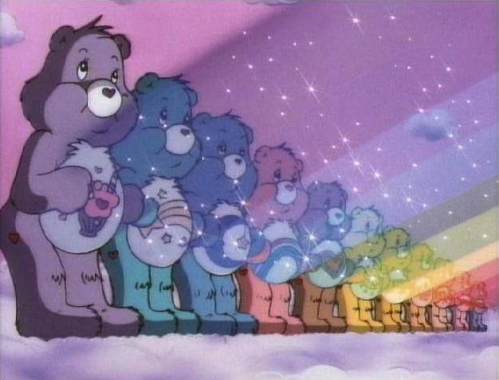
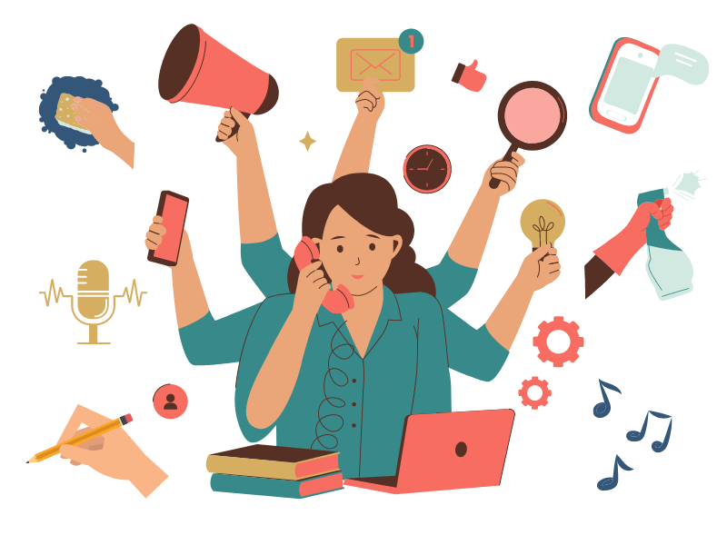
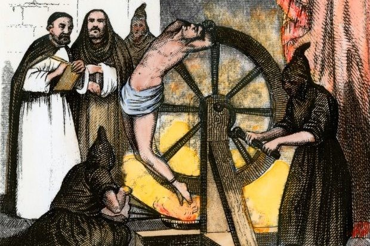

# Understanding Nature

- [Understanding Nature](#understanding-nature)
  - [Intro](#intro)
  - [Strength in Numbers](#strength-in-numbers)
  - [Compete and Conquer](#compete-and-conquer)
  - [AI To Accelerate, vroom vroom](#ai-to-accelerate-vroom-vroom)
  - [Solving Human Deficits](#solving-human-deficits)
  - [We Haven't Blown Each Other Up](#we-havent-blown-each-other-up)

## Intro

It's interesting to me that much AI is modelled after our knowledge of neuroscience. Humans have been stealing ideas from nature since we became intelligent enough to invent - this is called biomimicry. 

Unfortunately we don't have any examples in nature of a species more intelligent than humans.

## Strength in Numbers

An individual human is like an ant - very limited on their own. A whole colony of humans united are an incredible force. Humans do best when collaborating with one another towards a common goal. There are endless examples of this in human history.

  

<i>The power of friendship always wins!</i>

---

So why do we fight? 

## Compete and Conquer

*The Selfish Gene* by Richard Dawkins walks through a very coherent view of life's origin. It's proposed that life likely started from 1 "replicator" - an abstract concept of something that could create more of itself. From there, mutations of the replicated, adaptations to different environments compounded by time led to the vast biodiversity we see today.

As with our origin of The Replicator, we were born to compete. All living things compete, and we reward the winner with a legacy of its "copies". It's not even so much a reward as a sort of autonomous process of continueous refinement.

> _NOTE_ - Natural selection "success" is based on suitability for a certain environment. This does not mean that natural selection leads to some ultimate, ultra-strong, ultra-smart life form in the end.

It's in our very biology to compete, which can involve violence at times. Our biology is why we compete with other countries instead of collaborating peacefully towards a common goal. On a highly macro level, we work against our own best interests as a species. 

## AI To Accelerate, vroom vroom

AI gives us knowledge superhumans. By now it should be known that AI outperforms humans when it comes to being an encyclopedia of knowledge. I enjoyed [this video](https://www.youtube.com/watch?v=jGZOi-7haCw) by mathmetician Ken Ono where he references AI as a type of "librarian".

As where it stands now, AI can be used as a multiplier; we have a very limited number of individuals that have the skillsets & aptitude to work on cutting-edge problems in the medical, technological and social problems of society. AI can free these individuals from arduous, repetitive manual tasks of their vocation, allowing them to perform more efficiently.

There are many problems with tricky bottlenecks involving brute force computation that AI can help unstuck by pattern-matching. We'll enjoy the fruits of this success over the coming years.

## Solving Human Deficits

But what about "solving" human biology?

In theory humans could use AI to help us "solve" our own biology (genome, patterns of chemical signalings, deriving insights from simulations, etc.). New insights could perhaps help us understand how we might increase our own intelligence at a genetic level. 

There is also a newer concept of [moral bioenhancement](https://en.wikipedia.org/wiki/Moral_enhancement) I remember reading about in college. Since our biology can fuel objectively harmful behaviors, such as unease around other humans who don't look like "our tribe" (ethnic group, LGBT status, disability status, etc.) or competitive/aggressive behaviors, or even addiction-fueled behaviors, why not try to modify that biology? Of course, there are a lot of ethical debates around this. I'm not proposing it's the right solution, only that it's a possibility. 

I believe the root cause of many high-level issues humanity faces is tied to our biological limits. 

  

<i>I wouldn't turn down some extra arms, why not?</i>

## We Haven't Blown Each Other Up

Despite all the awful things us humans do to each other and have done to each other in history, I think we're getting better when it comes to exercising our intelligence to address harmful biases and increasing empathy to one another.

We've had nuclear weapons for decades, yet we haven't blown each other up after witnessing the devasting effects of the aftermath of the US atomic bombings on Japan in 1945. That's pretty amazing considering all of the tensions and fighting that still happen today. 

Somewhere in those primate brains of ours, we seem to know that blowing up a whole country is proooobably a bad idea.

  

<i>In modern society, we don't do this crap anymore. There's no public hangings, no crucifying and no burning at the stake. We gotta start somewhere.</i>

---
