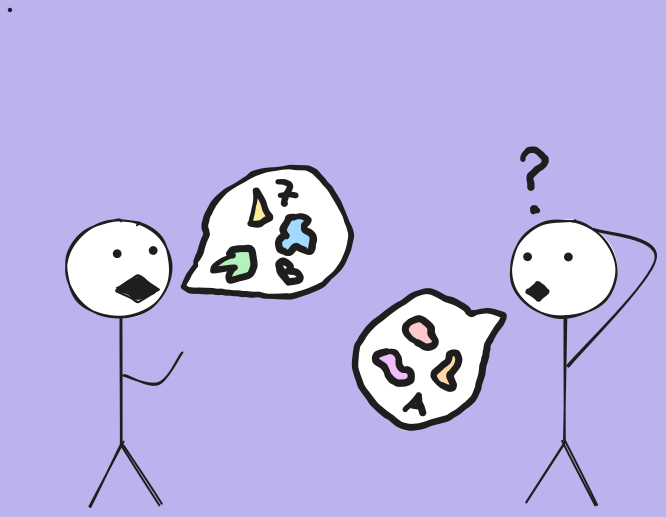
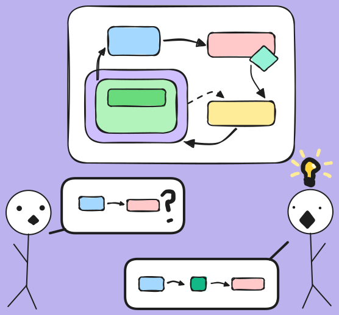
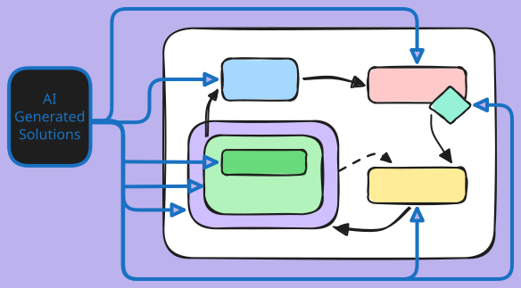

# Why Diagrams Are Important

## Adapting to Modern Times

I used to hate diagrams and find them to be of limited value. They take time to make, there's different standards to follow. And when you make one, the audience who views them may show confusion or indifference.

However, in the current age of AI I'm finding that diagrams are more important than ever. My colleagues and I use generative tools to code more and more. Handwritten code and reading code line-by-line will be a thing of the past; in many ways it already is.

As software engineers, we adapt to this by thinking at a higher level. We need to understand the systems we are building from a bird's eye view. This is no longer just the responsibility of a software architect. 

## Communication Is Key 

Have you ever been in a meeting where technical terms, acronyms and passionate soapboxing are going on, and you have no idea what the hell everyone is talking about? Or maybe you *think* you and a colleague are both talking about apples, but after further discussion, you realize they're actually talking about pears!

> A picture is worth 1,000 words! Truly.

Diagrams provide a great way to:

- Help verify everyone is on the same page with their understanding.
- Make talking about abstract technical concepts a lot easier.
- Help find potential redundancy or opportunities for more or less abstraction; sometimes seeing all the pieces together helps find smells or room for improvements.

> For myself personally, I find a lot of verbal information coming in at once to be exhausting. My brain tries to latch onto context, but if I'm out of my element, I get mentally fatigued and start to check out. I've felt dumb in the past for not being able to hop in with my own words during such occasions. Visual cues and aids can really make a night and day difference. I'm certainly not alone in this.

Today, one of my colleagues presented his diagram of a system I have been confused about. He seemed to have a better understanding of what was going on than I did. I'd been nagging him to diagram and he was up for the challenge! It's a system with a lot of [unnecessary] abstraction, plus it involves Kubernetes (which uses vague terms like Deployment, Pod, Service, Node, etc.). Talking about it can be kind of hard, especially for a team with little to no experience using Kubernetes. The visuals of the diagram my colleague presented helped us during the meeting.

It was exciting to see how the discussion changed when there were visuals on the screenshare. More questions were spawned and these questions chained into discussion rabbit holes. Despite the meeting running well over time, the energy levels seemed to remain high and people stayed engaged.

## AI Is Pushing Us To Be Architects

Software engineers used to create solutions by hand, carefully writing each line. But now, we have tools to generate those solutions for us. The generative tools will *always* be faster.

Software engineers now need to move up an abstraction level. The questions are no longer "How will you make the bricks?" or "How many bricks can you make a day?". The questions now are "How will the bricks fit together? How do we verify the integrity of our bricks?".