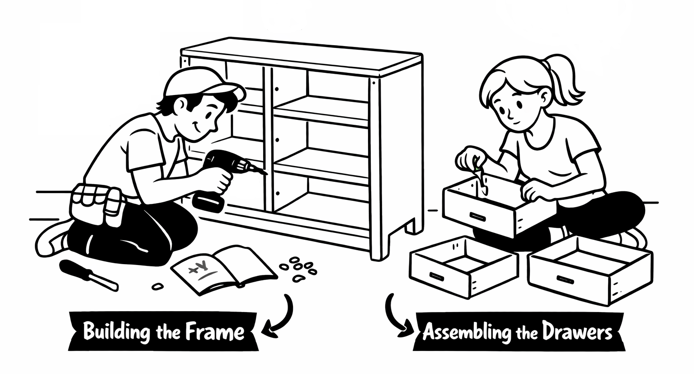
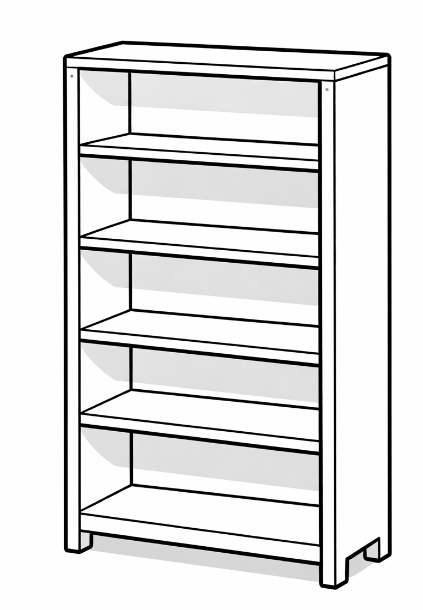
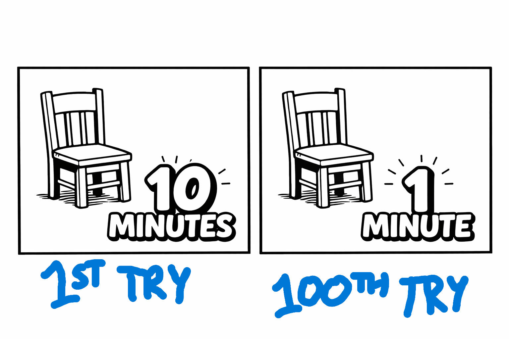
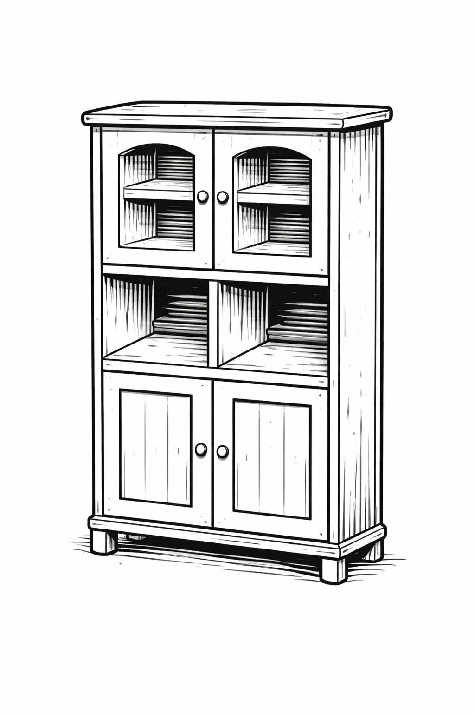
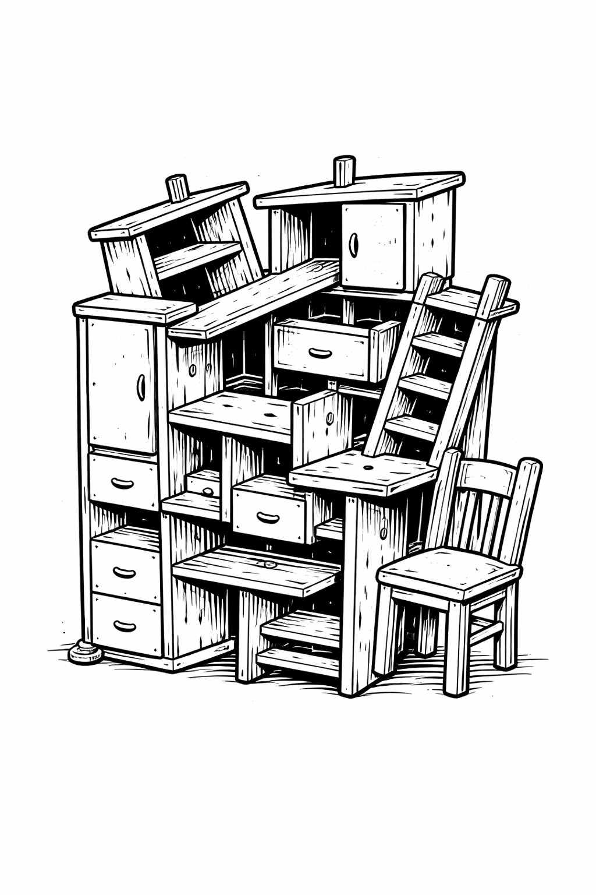

# Work Estimation Challenges

How come work estimation for software development is so difficult and hand-wave-y?

Let's walk through some analogies.

## IKEA Furniture

## The Dresser and the Bookshelf

Imagine building an IKEA dresser:

A dresser is a good example of a piece of furniture that can be assembled by 2 people in parallel. 

Now imagine trying to split the work for building an IKEA bookshelf:

Working in parallel doesn't work very well here; the shelves don't need much assembly and **they can't be added until the frame is done**. Sure, *some* work could probably be divided but it doesn't pan out as nicely as the dresser.

**Imagination time again** - pretend you didn't know much about furniture and you only knew that both the dresser and bookshelf were large, rectanglar pieces that could store items.

> "Why can't the bookshelf be built faster with 2 people like it was done with the dresser? Aren't they kind of the same thing?"

Well yes. But also no.

## The Chair Master

I once had a job that required assembling cheap little chairs for temporary events like banquets, weddings, etc.

The first time I assembled the chair, it took a while.

But after doing this over and over, I could assemble chairs much faster.

If someone saw me build a chair in 1 minute, there are some **illogical** conclusions they might come to:

- This person can also build similar pieces of furniture in 1 minute.
- Anyone should be able to come in and build a chair in 1 minute.

## Furniture Building Proficiency Over Time

Pretend Sally works as a contractor on Task Rabbit and she has assembled 100+ different pieces of IKEA furniture over time. Her **average assembly time per piece of furniture is 90 minutes**.

How long will it take Sally to assemble this? 

90 minutes? Half a day? What does Sally think? Let's pretend Sally hasn't ever assembled this exact piece of furniture before.

> Sally says, "Probably somewhere between 2 - 3 hours."

Sally gives a **range** because not everything is predictable. For example:

- What if there is an unanticipated, frustrating part of the assembly that ends up taking extra time?

- What if there are missing pieces in the assembly kit?

### The Furniture Building Novice

Adam has never assembled a piece of IKEA furniture. How long will it take Adam to assemble a bookshelf?

> Adam says, "I can do it in an hour!"

Adam doesn't actually know. Adam is just eager to have a chance at the job.

### Magical Furniture

After some brainstorming and planning,  you've come up with a new idea for a new piece of furniture. You want Sally to assemble it:

How long will it take Sally to build this? Should Sally build it?

> Sally says "Hell no!"

Sally would (and *should*) probably push back on this design as not something that should be created. Perhaps there was a misunderstanding somewhere in the design.

Adam, being a furniture novice, perhaps doesn't know that this furniture design is sort of garbage. He may spend a bunch of time giving it his best attempt. And in the end, no one will be happy.